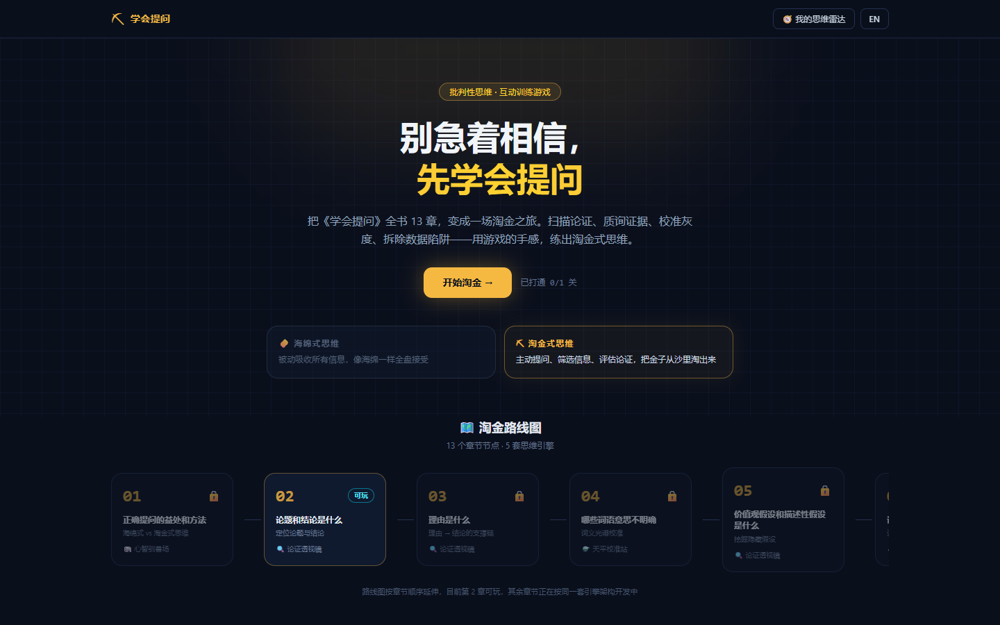
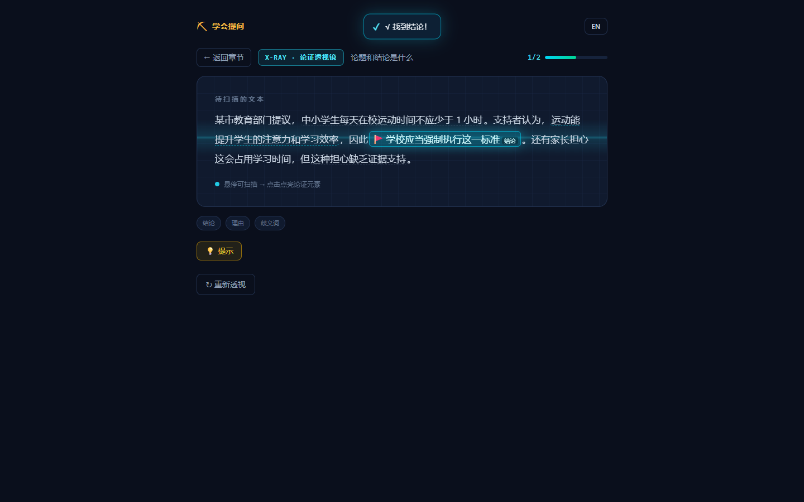

# ⛏ 学会提问 · Asking the Right Questions

**别急着相信，先学会提问。** 一本《学会提问》（原书第 12 版）的交互式批判性思维训练游戏集：把全书 13 章提炼成 **5 套可复用的思维引擎**，用游戏的手感练出「淘金式思维」——扫描论证、质询证据、校准灰度、拆除数据陷阱、驯服思维冲动。

数据驱动（JSON 关卡）+ 中英双语（EN/ZH）+ 纯前端零后端。任何人都可以**只填 JSON 就贡献一个全新关卡**。



## ✨ 特性

- **不是刷题，是执行思维动作**：5 套游戏引擎覆盖 13 章，每套引擎对应一组原书思维动作（透视 / 质询 / 校准 / 拆弹 / 驯服）
- **内容与引擎完全分离**：关卡 = 一份 JSON（结构判定）+ 一份 i18n 文本包（EN/ZH），贡献者不碰任何代码
- **双语原生支持**：语义锚点匹配（找"原文片段"而非字符偏移），翻译永不错位
- **本地进度 + 六维思维雷达**：通关点亮「结构识别力 / 证据鉴别力 / 假设挖掘力 / 谬误免疫力 / 数据免疫力 / 情绪自控力」
- **分级提示 + 深度解析**：每题附 3 级提示（方向 → 具体 → 位置）与通关后的原书逻辑拆解



## 🧩 五套思维引擎

| 引擎 | 思维动作 | 视觉/手感 | 覆盖章节 |
|---|---|---|---|
| 🔍 论证透视镜 X-Ray Scanner | 扫描文本找论题/结论/理由/假设 | 句子被 X 光"透视"出骨骼，点击点亮论证骨架 | 第 2 / 3 / 5 / 11 章 |
| ⚖️ 逻辑法庭 Courtroom | 评估证据效力、质询信源 | 逆转裁判式"证词击碎"打脸爽感 | 第 6 / 7 / 8 / 9 章 |
| ⚗️ 天平校准站 Calibration | 判断歧义与结论的合理区间 | 连续光谱拖动，命中"专家共识区间"靶心 | 第 4 / 12 章 |
| 🧨 数据拆弹 Defusal | 识破统计陷阱 | 限时剪线，拆弹成功图表"剥落"露出真相 | 第 10 章 |
| 🐘 心智驯兽场 Taming Arena | 克制快思考的情绪冲动 | 大象与骑象人，开场教程关 + 终章 BOSS 关 | 第 1 / 13 章 |


## 🚀 快速开始

```bash
npm install
npm run dev        # 本地开发，默认 http://localhost:5173
npm run build      # 构建静态站点（可部署到 GitHub Pages）
npm run preview    # 预览构建产物
```

## 📁 目录结构

```
src/
├── engines/       # 5 大引擎（渲染 + 判定逻辑，与内容完全分离）
│   └── xray/      # 引擎A 论证透视镜（MVP 已实现）
├── content/
│   ├── levels/    # 关卡数据（核心！社区贡献主要改这里）
│   │   └── chapter-02/
│   │       ├── level-01.json        # 结构与判定（不含任何语言）
│   │       └── level-01.i18n.json   # EN/ZH 双语文案
│   └── chapters.ts                  # 13 章元数据
├── schema/        # Zod 运行时校验：JSON 写错开发期即报错
├── store/         # Zustand：进度 / 设置 / 全局反馈
├── components/    # 跨引擎通用组件（toast / 提示 / 结算）
└── pages/         # 首页淘金地图 / 章节 / 关卡 / 思维雷达
```

## 🎮 贡献一个关卡（Good First Issue）

你不需要懂 React，只需要：

1. 复制 `src/content/levels/chapter-02/` 里的两个文件，改名为你的关卡（如 `chapter-03/level-01.json`）
2. 在 `level-01.json` 里描述论证结构（哪个节点是结论、哪个是理由、干扰项）
3. 在 `level-01.i18n.json` 里填中英文正文、提示与解析
4. 提交 PR —— CI 会自动校验：字段完整性、双语是否齐、锚点能否在正文中匹配到

> 翻译一个新语言同理：只需在 `.i18n.json` 里新增一个语言块，完全不会碰判定逻辑。

## 🗺️ 路线图

- [x] 阶段 0-1：脚手架 + 引擎A（论证透视镜）+ 第 2 章关卡
- [ ] 阶段 2：第 3/5/11 章关卡 + 理由→结论连线判定
- [ ] 阶段 3：完整 i18n 接入 + 进度页完善
- [ ] 阶段 4-6：引擎 B/C/D/E（法庭 / 天平 / 拆弹 / 驯兽场）
- [ ] 阶段 7：六维雷达图 + 战绩分享卡
- [ ] 阶段 8：GitHub Pages 自动部署 + 关卡脚手架 CLI

## 📄 License

[MIT](LICENSE) © MistStride
